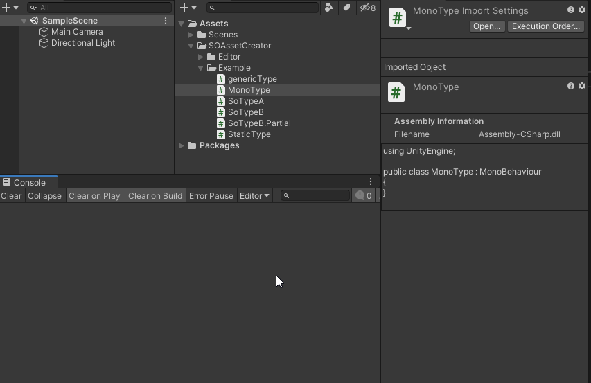

# ScriptableObject-Asset-Creator
 通用的 ScriptableObject .asset 文件生成工具/Generic ScriptableObject ".asset" file generation tool.

 # 功能：

1. 支持多选：现在支持同时生成多个 ScriptableObject 的 .asset 文件。

2. 加入提示：Partial 的没写继承的脚本 以及 静态脚本不支持会在 控制台输出

3. 右键校验：选中的非 ScriptableObject 则菜单不激活。

4. 把 asset 数据文件和脚本区分开，把生成的所有 asset 框选高亮出来。

# 演示
 

 演示说明：

1. 演示单个、多个 ScriptableObject 的 asset 文件创建

2. 演示对ScriptableObject类型  Partial 写法的支持。

3. 演示了非 ScriptableObject 类型选中后菜单不激活且控制台输出友情提示。

4. 多选脚本其中发现有非 ScriptableObject 立刻告知用户，不会做多余的遍历。

# 申明
版权所有

遵循 MIT 共享协议

# Reference
[雨落随风的简书](https://www.jianshu.com/p/0a00fccbeec0)

